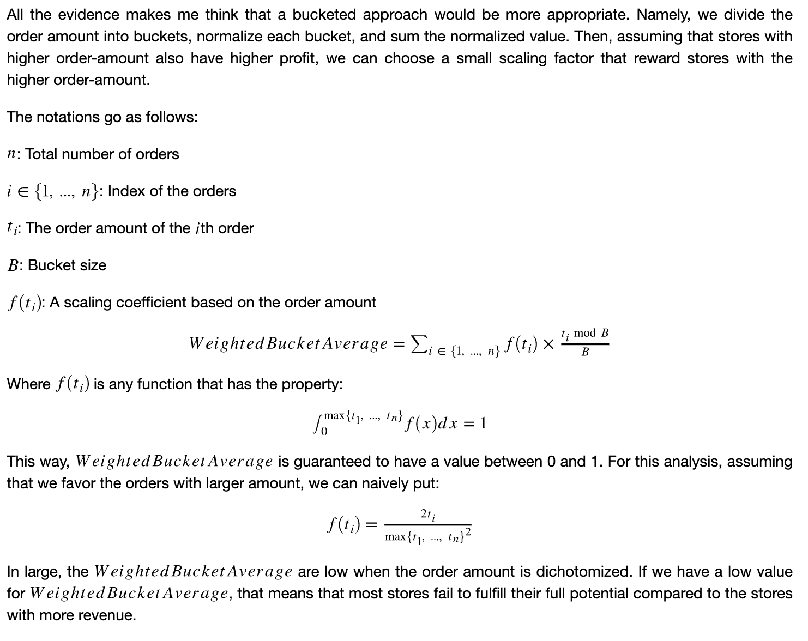
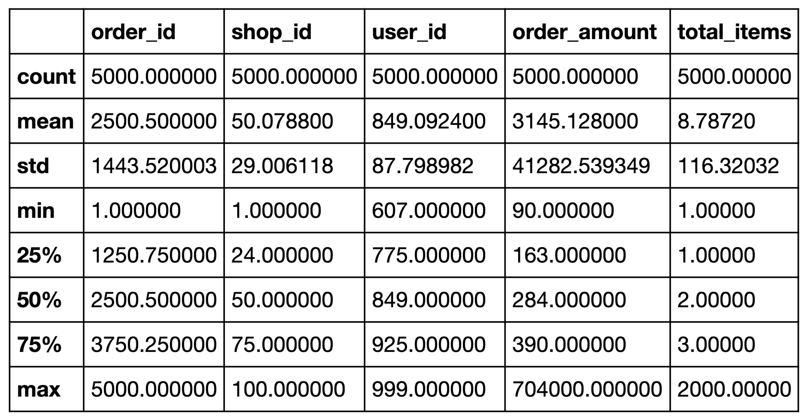
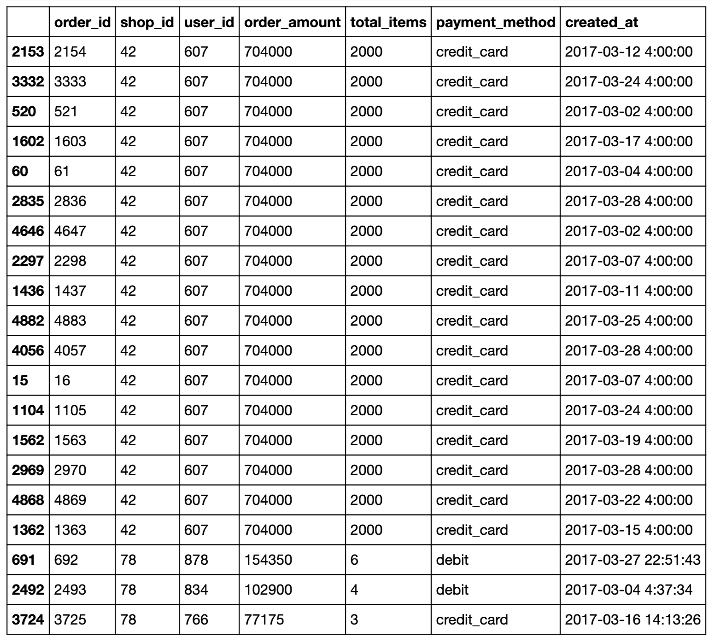
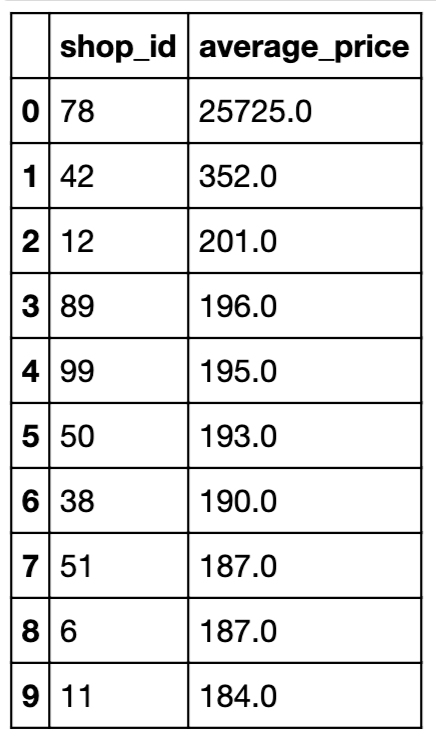
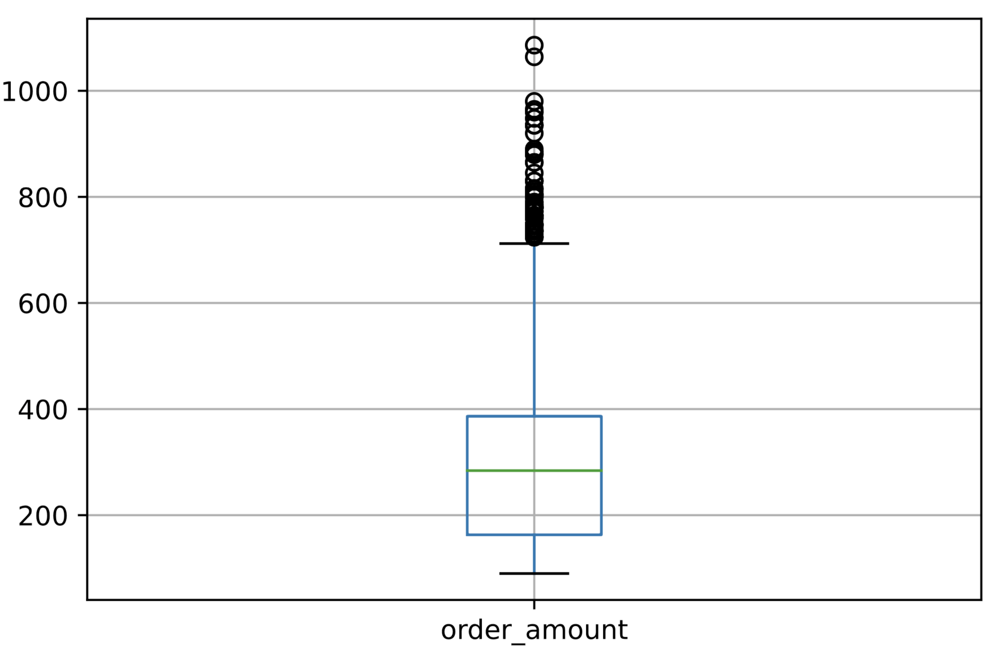
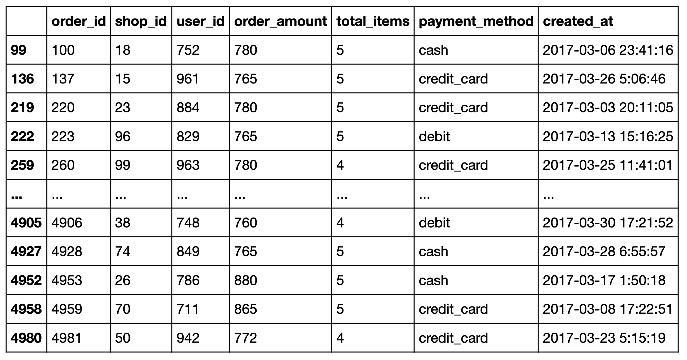

# Shopify Data Science Fall 2021 Challenge
# Part 0: Summary
## Q1.1: What's wrong with the AOV metric?

The order amount of stores 42 and 78 deviates significantly from the results of the orders both in terms of the transaction total and prices per shoe. Therefore, the AOV is inflated largely due to these two outliers.

## Q1.2: What metric would I use?
**Because GitHub's README does not support Latex, I screenshot my answers and pasted it below.**


## Q1.3: What is the value of the metric?

For my metric, I choose $B = 100$. The resulting $Weighted Bucket Average$ is 0.34579170882489824

## Q2.1: How many orders were shipped by Speedy Express in total?
There are 54 orders shipped by Speedy Express

```sql
SELECT COUNT(*)
FROM Orders JOIN Shippers ON Orders.ShipperID = Shippers.ShipperID 
WHERE Shippers.ShipperName = 'Speedy Express';
```

## Q2.2: What is the last name of the employee with the most orders?
The last name is Peacock with 40 orders

```sql
SELECT LastName, COUNT(OrderID) as NumOrders
FROM Orders JOIN Employees ON Orders.EmployeeID = Employees.EmployeeID
GROUP BY Employees.EmployeeID
ORDER BY NumOrders DESC
LIMIT 1;
```

## Q2.3: What product was ordered the most by customers in Germany?
The product is Boston Grab Meat with 60 orders from Germany.

```sql
SELECT ProductName, SUM(Quantity) AS NumProducts
FROM Orders JOIN OrderDetails ON Orders.OrderID = OrderDetails.OrderID
JOIN Customers ON Orders.CustomerID = Customers.CustomerID
JOIN Products ON Products.ProductID = OrderDetails.ProductID
WHERE Customers.Country = 'Germany'
GROUP BY ProductName
ORDER BY NumProducts DESC
LIMIT 1;
```

# Part 1
## Data Preprocessing
The first thing I did is to load the data and the dependencies into the notebook. In addition, I used the `.describe()` function to obtain some general statistics of the dataset. 



## Q1: What's wrong with the AOV metric?
The first thing I noticed is that the standard deviation of the order amount is extremely high. This is an indication that there are a lot of outliers in the dataset in terms of their order amount. Therefore, I try to identify the outlier by first listing orders that have the highest order amount.



It appears that the orders with the largest transactions all come from shop 42 and 78. In addition, judging by the `order_amount` and `user_id`, it appears that most shoes sold at store 42 all come from the same user at exactly 4:00 on the day of the transaction. This is might be a sign that store 42 is involved in some dubious behavior using automated trading bots. However, we cannot conclude without further information. Therefore, let's see how much the shoes in store 42 and 78 on average. To do this, I added up all the `order_amount` in each shop and divided it by the `total_items`.

```
Average shoe price of store 42: 352.0
Average shoe price of store 78: 25725.0
```

To put this input perspective, let's see the top 10 stores that have the highest prices per shoes:



**Answer: Judging by the results from previous cells, we can see that the order amount of stores 42 and 78 deviates significantly from the results of the orders both in terms of the transaction total and prices per shoe. Therefore, the AOV is inflated largely due to these two outliers.** 

## Q2: What metric would I use?
As we can see, except for store 78 and 42, all the other stores' shoe prices are in a similar range as the rest of the shop. Therefore, let's see the distribution of the order amount after removing stores 78 and 42. 



According to the documentation of `pandas.DataFrame.boxplot`, the edges of the box indeicates the 1st (Q1) and 3rd (Q3) quartile of the of the order amount while the line in the middle is the median. The whisker extend outward by no more than 1.5 * (Q3 - Q1). As shown by the dots on the top of the graph, there are some outliers above the top whiskers even after store 42 and 78 are eliminated. The following code shows you how many outliers are outside of the whiskers:



As we can see, we only have 77 outliers above the top whiskers. This is not too bad, since they are only a fraction of the 5000 orders in the dataset. However, we can also see from the bar graph that the median deviates drastically from the more expensive orders. This means that, although we have eliminated the obvious outliers, we still have a lot of high-end shoe store that charges at a price much higher than the median price.

**Because GitHub's README does not support Latex, I screenshot my answers and pasted it below.**


## Q3: What is the value of the metric?
For my metric, I choose $B = 100$.

**Answer: The value of my metric is 0.34579170882489824.**